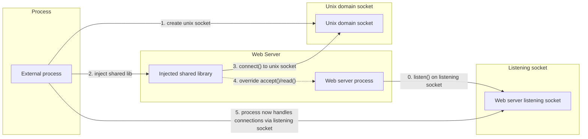
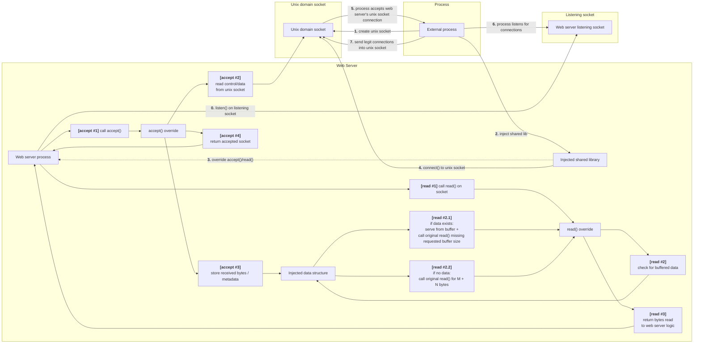

# Solution (WIP)

This solution wasn't completely executed, the current code uses GOT Injections which work on dynamically linked processes and not on statically linked processes. I specify a solution for statically linked servers at the end of this file.

**Note:** When referencing Solutions #N.M, look at `thinking_process.md`


This solution requires dlopen to be loaded into target process memory. Ideally you would want a generic soltuion, the solution to this would be to use  `__libc_dlopen_mode()` which basically does what dlopen does, but is loaded by libc (which is obviously loaded by and dynamically linked web server). I couldn't get this to work since `__libc_dlopen_mode()` is considered `GLIBC_PRIVATE` on modern systems (like mine) and would need some sort of exploit to get access to it (maybe search inside libc's loaded memory for it).

#### The plan:
1. Create a process
2. Create a unix-socket at some known (static) destination `/tmp/injection_socket`
3. get access to the web server listening socket.
4. Use Ptrace to attach to the process
    1. Inject a shared library  (using dlopen) **<-- For Dynamically linked processes**
    2. Use dlsym to find the glibc's accept & read functions memory address in the web server memory.
    3. override these functions (somehow) with my own functions (logic explained below)
    4. connect to the unix socket
5. Use Ptrace to detach from process
6. Accept connections via my process, pass legit connections using the unix socket (SCM_RIGHTS) to the injected code in the web server. using my overriden functions, inject the socket when the web server calls accept().

#### How was i going to solve each step?

**1 -** Creating a process is easy (Compiled C code).

**2 -** Creating a unix with glibc standard library. make sure that `/tmp/injection_socket` has read/write/execution permissions by all everyone (chmod 777)

**2 -** To get access to the web server's listen socket:
- Use Solution #3.1 to find the PID/FD/INode
- Send the listening socket FD that we found in step #1 to the unix socket, the injected web server library is listening and will receive this, and send the listening socket with SCM_RIGHTS over the unix socket back to the process.
- Process reads the listening socket FD from the unix socket


**3:** 
1. Use Ptrace to attach to the process
2. Inject a shared library (using dlopen):
    1. find the web server's dlopen's memory address (Exists only in web server that were dynamically linked, for static linked programs a different solution exists)
    2.  backup current registers
    3. find some memory section in the web server's memory that has exeuction privledeges
    4. read and backup 64 bytes of that memory
    5. write our shared library's path to the executable memory section we found (must be less that 64 bytes to prevent overflow)
    6. Set current register values to have the remote process's dlopen to load the shared library. lastly send a BRK instruction (creates a SIGTRAP syscall)
    7. resume process and listen to SIGTRAP syscalls, this will have the web server's dlopen load ower shared library into memory and call.
    8. pause process on SIGTRAP syscall interception
    9. verify that dlopen's injetion worked
    10. Undo all changes so we don't break the web server's process (restore registers & executable memory we found at 2.5)
3. The shared library has a contructor which is called on successfull load by the process loading it. 
    1. Connect to the unix socket
    2. override (hook) the accept & read functions <-- GOT Injection


**4 -** Detach using Ptrace.

**5 -** If all above steps are succeeded i basically have the following:




We will implement a GOT Injection to override the glibc's accept() & read() functions used by the web server to accept connections and read connection data with our own hook. The GOT injection is exmplained in `final_solution.md`, i will go over the accept & read logic here:

**Accept:**
This function is a blocking function (similar to the original glibc accept). It does the following:

Is unix socket connected?
**No -** call glibc's accept function and return its value. This is relevant if we hooked but injection failed or if we hooked and haven't connected to the unix socket yet.
**Yes -** call the glibc's accept function on the unix socket (Basically waiting for a TCP Socket to be sent over the unix socket from our process thats listening to the original web server listening socket). 
Each entry in this unix socket contains 2 things:
- The connection socket's FD (passed with SCM_RIGHTS to the web server)
- X bytes read by the process to check if the connection is legit/home. Since we pass the connection to the web server, it was legit meaning we need to injec these bytes via the hooked read function to prevent data loss. These X bytes are stored in a data structure initialized by the shared library we injected.

**Read:**
The server called it's read function and requested M bytes
1. Read X bytes from the data structure we initialized.
2. if data exists, read `M - X bytes` and return this concatenated
3. else read M Bytes and return read data.

This solution checks all boxes! 



## WIP: GOT Injection

WIP!

## WIP: Possible solution for statically compiled servers (Theoretical)


### Statically linked process <ins>with</ins> symbols
This is the easier option.
We can search for the function we want to hook using dlsym (like in the current implementation).
### Statically linked process <ins>without</ins> symbols

This overall solution is similar to the one above but instead using a GOT Injection, we need to go over the loaded code in web server memory, find all places that call a syscall thats being called by the function we want and replace, replace the instructions with JMP instruction to our hooked function.

Since were going over a process's loaded code in memory, it will be in assembly but that doesn't stop us. we still know what to look for, i'll give an example:
Lets say we want to hook the accept function from libc, the libc accept implementation must send an accept syscall to the kernel since the actual socket actions happen in kernel space and syscalls is the communcation method between the process & kernel. That means that if we know how to identify accept syscalls (which we do), we replace them in the process memory with a JMP to our hooked function (I'm not sure how jumping back to where the JMP was works after my hooked function finishes loading).

When calling a syscall, you need to run 2 instructions:
```
Mov eax, (The syscall ID)
Syscall
```
Or:
```
Mov rax, (The syscall ID)
Syscall
```

so all we need to do is search the loaded code in memory for these 2 instructions (one after the other) with the accept syscall id and replace them with


Their are 2 Possible variants we need to support. 