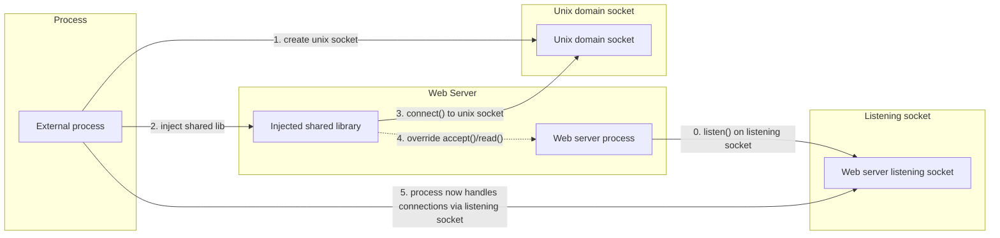
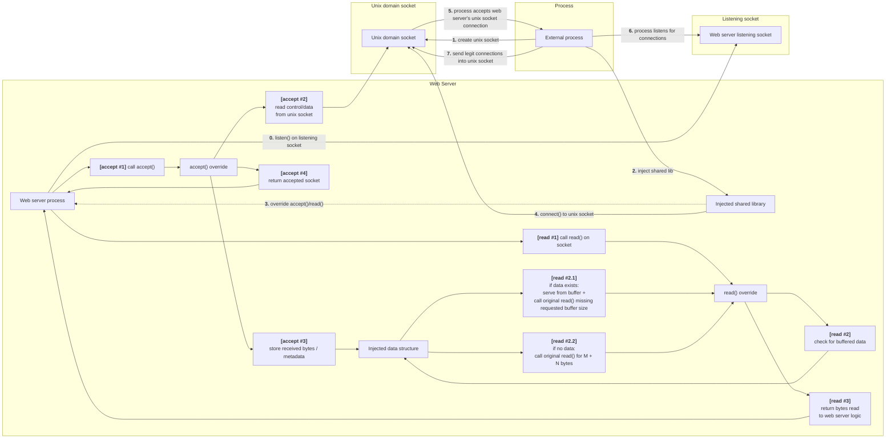

# Solution Walkthrough

## Prerequisites
The final solution doesn't solve the exercise for all web server process types (works on dynamically linked processes only ATM), but is a solid foundation for the requirements. The current code uses GOT Injections to hook dynamically linked processes, a solution for statically compiled processes is presented bellow but wasn't executed in code due to lack of time (EOF).

**Note:** References to solutions referer to `thinking_process.md`

## The plan:
1. Create a process
2. Create a unix-socket at some known (static) destination `/tmp/injection_socket`
3. get access to the web server's listening socket.
4. Use Ptrace to attach to the process
    1. Inject a shared library  (using dlopen) **<-- For Dynamically linked processes**
    2. Use dlsym to find the glibc's accept & read functions memory address in the web server memory.
    3. override socket accept/read functions (GOT Injection) with my own functions (explained below)
    4. connect to the unix socket
5. Use Ptrace to detach from process
6. Accept connections via my process, pass legit connections using the unix socket (SCM_RIGHTS) to the injected code in the web server. Using the overriden functions, inject the legit connections to the web server when it calls accept().

### Per step walkthrough

**1 -** Creating a process is easy (Compiled C code).

**2 -** Creating a unix with glibc standard library. make sure that `/tmp/injection_socket` has read/write/execution permissions by all everyone (chmod 777)

**2 -** To get access to the web server's listen socket:
- Use Solution #3.1 to find the PID/FD/INode
- Send the listening socket FD that we found in step #1 to the unix socket, the injected web server library is listening and will receive this, and send the listening socket with SCM_RIGHTS over the unix socket back to the process.
- Process reads the listening socket FD from the unix socket


**3:** 
1. Use Ptrace to attach to the process
2. Inject a shared library (using dlopen):
    1. find the web server's dlopen's memory address (Exists only in web server that were dynamically linked, for static linked programs a different solution exists)
    2. backup current registers
    3. find some memory section in the web server's memory that has exeuction privledeges
    4. read and backup 64 bytes of that memory
    5. write our shared library's path to the executable memory section we found (must be less that 64 bytes to prevent overflow)
    6. Set current register values to have the remote process's dlopen load the shared library. lastly send a BRK instruction (creates a SIGTRAP syscall) to know that the shared lib was loaded.
    7. resume process & listen to SIGTRAP syscalls.
    8. pause process on SIGTRAP syscall interception
    9. verify that dlopen's injetion worked.
    10. Restore register & memory changes we made to inject the shared lib so we don't break the web server process - don't raise suspocion.
3. The shared library has a contructor which is called on successfull load by the process loading it. 
    1. Connect to the unix socket
    2. override (hook) the accept & read functions <-- GOT Injection


**4 -** Detach using Ptrace.

**5 -** If all above steps are succeeded i basically have the following:




We will implement a GOT Injection to override the glibc's accept() & read() functions used by the web server to accept connections and read connection data with our own hook. The GOT injection is explained in `final_solution.md`, i will go over the accept & read logic here:

**Accept():**
This function is a blocking function (similar to the original glibc accept). It does the following:

Is unix socket connected?
**No -** call glibc's accept function and return its value. This is relevant if we hooked but injection failed or if we hooked and haven't connected to the unix socket yet.
**Yes -** call the glibc's accept function on the unix socket (Basically waiting for a TCP Socket to be sent over the unix socket from our process thats listening to the original web server listening socket). 
Each entry in this unix socket contains 2 things:
- The connection socket's FD (passed with SCM_RIGHTS to the web server)
- X bytes read by the process to check if the connection is legit/home. Only legit connections get passed to the web server, meaning we need store and inject these bytes via the hooked read function to prevent data loss when the web server calls the read function for that FD. These X bytes are stored in a `data structure` initialized by the shared library we injected.

**Read():**
The server called it's read function and requested M bytes
1. Read X bytes from the data structure we initialized.
2. if data exists:
    2.1. Read `M - X bytes` from the requested FD, concatenate the `X bytes` with the `M - X bytes` and return this value. Then clear the `X bytes` from the `data structure`.
3. else read M Bytes from the FD and return read data.

This solution checks all boxes! 



# In depth explenation

### Injecting a shared library
**Shared library:** our malicous code, enables us to MITM connections.
**Goal:** The current solution required dlopen to exist in the target process's memory, we locate it and use it to load a malicous shared library.

Ideally you wouldn't want to rely on dlopen existing in target memory, i haven't found a solution to this due to lack of time. A possible solution would be to use  `__libc_dlopen_mode()` which basically does what dlopen does, but is loaded by libc (which is obviously loaded by a dynamically linked web server). I couldn't get this to work since `__libc_dlopen_mode()` is considered `GLIBC_PRIVATE` on modern systems (like mine), would need some workaround for this (maybe find a different way to search for dlopen inside target's loaded libc)..

#### Locating remote process's dlopen
Since ASLR exists, we can't, we need to use offset calculations. We search `/proc/{TARGET_PID}/maps` to find the libc library's address loaded into the target process's memory. Then we need to find the dlopen's address inside libc. How? Well ASLR doesn't change the allocations inside the loaded program code but changes where the code/heap/shared lib/stack exist relative to each other. We can use this to our advantage to calculate the target's dlopen address but dynamically loading the same libc into our process on the same machine, calculate the dlopen's offset from the libc's start address, that same offset will be valid to find the target's dlopen relative to the target's libc address (which we have).

## GOT Injection Explained
For each shared lib loaded by the target process (`dl_iterate_phdr()`):
1. From the shared lib's ELF, locate the address of variables such as the symbol table, string table & relocation table.
2. For each RELA entry:
    2.1. Filter out any relocation types that aren't functions
    2.2. Get the string associated with the symbol and use symbol's index in the symbol table to get the function's name from the string table. Filter functions with a different name then required override.
    2.3. We identifid the RELA entry associated with the function we want to override:
        2.3.1. Store the original function's memory address
        2.3.2. Overide the function's address in the entry with our hooked function (Actual GOT Injection) <- Since GOT Entries are usually read only, we need to make the memory writable usning `mprotect()`


## Possible solution for statically compiled servers (Theoretical)

### Statically linked process <ins>with</ins> symbols (Easier)
We can search for the function we want to hook using dlsym (like in the current implementation) and reuse most of the current GOT Implementation.

### Statically linked process <ins>without</ins> symbols
This overall solution is similar to the one above but instead of using a GOT Injection, we need to go over the loaded code in web server memory, find all places that call a syscall thats being called by the function we want and replace the instructions with JMP instruction to our hooked function.

Since were going over a process's loaded code in memory, it will be in assembly but that doesn't stop us. we still know what to look for, i'll give an example:
Lets say we want to hook the accept function from libc, the libc accept implementation must send an accept syscall to the kernel since the actual socket actions happen in kernel space and syscalls is the communcation method between the process & kernel. That means that if we know how to identify accept syscalls (which we do), we replace them in the process memory with a JMP to our hooked function & back.

When calling a syscall, you need to run 2 instructions:
```
Mov eax, (The syscall ID)
Syscall
```
Or:
```
Mov rax, (The syscall ID)
Syscall
```

so all we need to do is search the loaded code in memory for these 2 instructions (one after the other) with the accept syscall id and replace!