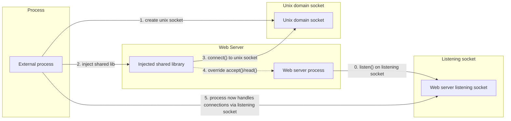
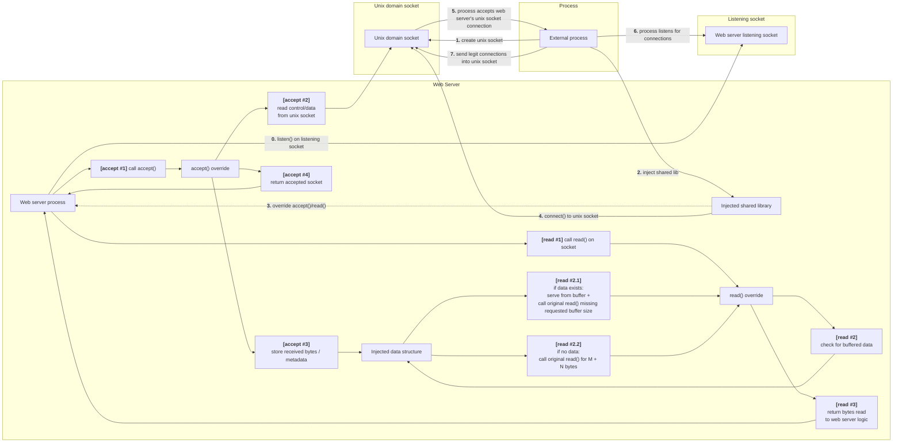

# Exercise Requirements

## The Assignment:
I have root access on a linux device and it has a running web server on port 443 (HTTPS).
My goal is to open and maintain a session over TCP on port 443 without it being suspicious to the device owner or the web server's clients.

## Assignment Boundaries (Requirments/Restrictions):

### Secrecy/Network traffic must be legit!
Not allowed to do anything that might be suspicous..
 - Full TCP 3 way handshake (No partial handshakes)
 - No RST or closing connections
 - All packets must look legit (No Header/Flag/Id/Token Injection)

### Linux Kernel has basic functionality
 - Kernel is pretty old (2.6.x)
 - Can't use Iptables, EBPF or any kernel routing/modification/dropping techniques to network traffic (later on, it was clarified that solutions in this space would be very hard to implement in a generic way. different kernel versions would need different solutions)
 - Use of Raw sockets isn't allowed and doesn't solve the exercise. Why? They are a "readonly solution", all session traffic will still be visible to web server -> **Against the Assignment boundaries**

## Solution Requirements
- Must be generic (should work on various kernel versions)
- Device source port traffic must be 443
- Device cannot initiate connection (No Reverse proxies..) (clarified later)
- The client's IP that initiates a session over port 443 is <ins>unknown</ins> ahead of time (clarified later)

# Thinking Process

I Started by understanding what the task paramaters allow/disallow and made a list. This list would help me narrow down the solutions to a few that are feasible.

## Facts
- A single socket can connect to a tuple of `<Protocol, IP, PORT> (TCP, IP, 443)` 
    - Even with root access, this restriction still exists
    - Each Protocol has it's own "Stack" (TCP Stack, UDP Stack..). Each Stack has it's own `IP:PORT` tuple.  
    - On **linux kernel 2.6.x**, a single socket is allowed per tuple.
    - on **linux kernel 3.9+** SO_REUSEPORT exists (basically a load balancer for a port. Doesn't solve the problem since some of the traffic will still go to the web server but it's a foot in the right direction!).
- A process can listen on `PORT < 1024` if it has root privledges or CAP_NET_BIND_SERVICE capabilities. **Good for us as we have root access!**
- Even root can't modify a socket's data (write, delete, skip, route..).
    - The kernel owns the TCP stack in kernel space (each socket has private receive/transmit queues protected in kernel memory).
    - The socket is owned by the process in user space.
- A Long lived session (like requested) can be closed by network devices (Such as FWs) if their isn't any traffic in the session (Keep-alives needed).
    - For protocols that aren't TCP based, usually some sort of ping needs to be sent to keep the connection alive. But this doesn't help too much since we must only use TCP..

## Possible Solutions

After scouring the internet for almost a day, I started look for possbile solutions, some could be legit (by Assignment boundaries) and some were borderline.

### Solution #1
Using a protocol that isn't TCP, maintain a session over port 443 (Each protocol has a different network stack).
**Relevant protocols would be:**
- QUIC (UDP Based) - Encrypted, Long lived sessions, very reliable (Used by HTTP/3) - my preffered choice.
- SCTP (Stream control transmission protocol) - Similar to TCP, can support Ordered delivery, Long lived sessions. No built in encryption. Poor real world adaption, most network devices will reject this protocol's packets.

**I Dropped this solution** because after asking about the solution legitimacy, additional Assignment boundaries were added (TCP only traffic was allowed).

### Solution #2
Similar to solution 2, what if i were to add another virtual network adapter creating another ip for the device and traffic my session over that? 
- Would be over TCP
- Would allow legit traffic

**I Dropped this solution** because after asking about the solution legitimacy, was hinted this wasn't in assignment boundaries either..

### Solution #3
This solution would be legal but initially i had no clue how to pull it off. A few evolutions later this solution would be my final solution.

#### What i know at this point:
- I can't somehow manipulate the traffic before in kernel/network space
- All assignment boundaries lead to legit, plain old TCP over port 443. No weird stuff..
- Any kernel modifications/updates/rules.. were irrelevant

So the only possible idea i had at this point was something in user space..
maybe a processs that acts like a proxy, passing legit requests to the web server, keeping session connections to itself.

#### But this "solution" has many problems to solve:
- How would my process get access to the socket on port 443?
- How would i prevent the currently running web server from receiving connections/data that are considered "home connections"?
- Proxied traffic from my process to the server would have a source ip of localhost - **suspicous!**

Then i got hinted:
- <ins>The proxy solution was "interesting"</ins>
- Learn about FDs, procfs.

**And 3 hours later.. i had my first legit & almost in assignment boundaries solution!**
After learning about both FDs & Procfs and experimenting live on a linux computer, i quickly found out a few very relevant facts:
- procfs was a virtual file system that contained info about running processes. It's basically an interace to kernel state about running processes. (cool!)
- root has access to the procfs /proc directory - **Very good as we have root access**
- A Inode is the fundemental metadata structure for every file/directory on disk. Contains:
    - File type
    - File permissions
    - file size
    - pointer to where the file's data blocks are stored
    ..
- FD (File descriptor) is a file in procfs representing an open file, socket or other I/O resource within use of a specific process. An FD is representing by a unsigned int (This will also be the file name in procfs).
    - A proccess's FD is listed under /proc/{PID}/fd/{FD} as a symlink to what the FD is connected to.
        - Socket FD's will print something like: `3 → socket:[402187]` where `[FD] → socket:[Inode]`
    - Each process has it's own FD table, every entry points to a File table, every file table entry points to a Inode in the Inode table. More than one FDs can point to the same File table entry.
        - **Basic idea:** Process -> FD -> Open file object -> Inode -> Disk/Socket (Network state)
    
**Bottom line,** I could use my root access to find out what sockets a process was using!

### The basic idea behind the solution:
1. Find out who is listening on port 443 and find it's socket via procfs
2. Create a process and have it get access to the socket
3. Prevent the web server from eavsdropping the connection
4. Somehow identify connections as legit/home connections
5. Communcate freely over the session (some response terminal)

#### How was i going to solve each step?

**1 -** All current TCP connections are stored in procfs at path: `/proc/net/tcp` (Ipv4) and `/proc/net/tcp` (Ipv6). I could read the file using root, identify all listening connections, within those connections find out which one is listening on port 443. Then i have it's Inode! Now that i have the Inode, i search for the pid & fid. How?
read all /proc/{PID}/fd/{FD number} files until i find one that points to the Inode i found. I know PID must be an int which helps narrow the search a bit.

**2 -** Creating a process is easy (C code). To get access to another process's socket all i had to do was have my process open the /proc/{Web server pid}/fd/{fd number} and my process gets it's own pointer to the underlying Inode!

**3 -** At this point in time, the only idea i had to prevent the server from eavsdropping on my home connection was allowing the web server to initially accept the connection, locate the home connection fds im intrested in, use steps 1 & 2 to get my process access to those FDs (meaning both the web server and my process will point to the file table entry pointing the the socket's Inode). Then delete the web server's FD file, AKA Closing it's connection. The web server should think the client closed the connection or some error occured and remove the client connection from it's active connections. Then you can freely pass data on the connection and the server will ignore it..
After proposing solution, it came to my attention that the home connection's ip will be logged to server logs, outside of assignment boundaries..

**4 -** Identifing home connections was challenging until i narrowed down what was allowed and what wasn't.
- No partial/suspicous network traffic was allowed, so monitoring the network like i originally planned for and looking for specific qualities in packets wasn't an option.
- After proposing solution, another assignment restriction was added. The home client's ip isn't known ahead of time :/

This basically means that my only option for identifing a home connection is by establishing a proper connection and passing some `unique home identifier` that will identify the connection has a "home connection". This was technically legal since the web server's legit users send HTTP protocol init/headers initially and any other traffic wouldn't be legal. In addition since were talking about HTTPS, which is encrypted, any monitoring along the way won't catch this as suspicious activity cause all it sees is encrypted msgs :)

After this, i was hinted to read about Ptrace, Syscals & unix sockets.

A day later i came back with another solution..
### Solution #4 (2 variations)

#### The basic idea behind variation #1:
1. Use PTrace to attach to the web server process
2. initiate a unix socket between the web server process and my process
3. get access to the web server's socket (Solution #3.2)
4. Using syscalls and Ptrace, interecept accept/read syscalls to "Steal connections" and data
5. identify home/legit connections and intercept only home connections.

#### The basic idea behind variation #2:
Same actions like variation 1, but do all the logic using "injected code" on the web server process (maybe with a different thread).
This solution was possible with `dlopen`. dlopen allows us to dynamically load shared objects (.so files) into the current running process dlopen is loaded on. This is used in legit cases were processes are dynamically linked execs (They refrence libraries from the OS instead of compiling them inside the exe).
Problems with this variation were:

These solutions were very theoretical (stages 2, 4, 5 and variation #2) and far from practical at that time.
Another known problem is that ptrace is usualy a debug tool, attaching to a process for ever could be harsh on performance thereforce suspicous (not allowed!)..

Then another hint came, variation #2 was in the right direction. I was also instructed to read about shellcodes & syscall injections.

### Solution #5
After a few hours i had learned a lot more about ptrace functionality, shellcodes & syscall injections. I had also learned a lot more about dlopen's abilities and use.

#### The plan:
1. Create a process, get access to the web server listening socket.
2. Create a unix-socket at some known (static) destination `/tmp/injection_socket`
3. Use Ptrace to attach to the process
    1. Inject a shared library  (using dlopen)
    2. Use dlsym to find the glibc's accept & read functions memory address in the web server memory.
    3. override these functions (somehow) with my own functions (logic explained below)
    4. connect to the unix socket
4. Use Ptrace to detach from process
5. Accept connections via my process, pass legit connections using the unix socket (SCM_RIGHTS) to the injected code in the web server. using my overriden functions, inject the socket when the web server calls accept().

#### How was i going to solve each step?

**1 -** Specified in above solutions.

**2 -** pretty easy..

**3:** 
1. Use Ptrace to attach to the process
2. Inject a shared library (using dlopen):
    1. find the web server's dlopen's memory address (Exists only in web server that were dynamically linked, for static linked programs a different solution exists)
    2.  backup current registers
    3. find some memory section in the web server's memory that has exeuction privledeges
    4. read and backup 64 bytes of that memory
    5. write our shared library's path to the executable memory section we found (must be less that 64 bytes to prevent overflow)
    6. Set current register values to have the remote process's dlopen to load the shared library. lastly send a BRK instruction (creates a SIGTRAP syscall)
    7. resume process and listen to SIGTRAP syscalls, this will have the web server's dlopen load ower shared library into memory and call.
    8. pause process on SIGTRAP syscall interception
    9. verify that dlopen's injetion worked
    10. Undo all changes so we don't break the web server's process (restore registers & executable memory we found at 2.5)
3. The shared library has a contructor which is called on successfull load by the process loading it. 
    1. Connect to the unix socket
    2. override (hook) the accept & read functions <-- GOT Injection

**4 -** Detach using Ptrace.

**5 -** If all above steps are succeeded i basically have the following:

We will implement a GOT Injection to override the glibc's accept() & read() functions used by the web server to accept connections and read connection data with our own hook. The GOT injection is exmplained in `final_solution.md`, i will go over the accept & read logic here:

**Accept:**
This function is a blocking function (similar to the original glibc accept). It does the following:

Is unix socket connected?
**No -** call glibc's accept function and return its value. This is relevant if we hooked but injection failed or if we hooked and haven't connected to the unix socket yet.
**Yes -** call the glibc's accept function on the unix socket (Basically waiting for a TCP Socket to be sent over the unix socket from our process thats listening to the original web server listening socket). 
Each entry in this unix socket contains 2 things:
- The connection socket's FD (passed with SCM_RIGHTS to the web server)
- X bytes read by the process to check if the connection is legit/home. Since we pass the connection to the web server, it was legit meaning we need to injec these bytes via the hooked read function to prevent data loss. These X bytes are stored in a data structure initialized by the shared library we injected.

**Read:**
The server called it's read function and requested M bytes
1. Read X bytes from the data structure we initialized.
2. if data exists, read `M - X bytes` and return this concatenated
3. else read M Bytes and return read data.

This solution checks all boxes! 

# References

### Ptrace reference:
https://blog.xpnsec.com/linux-process-injection-aka-injecting-into-sshd-for-fun/

### Shellcode reference:
https://github.com/gaffe23/linux-inject/blob/master/inject-x86_64.c